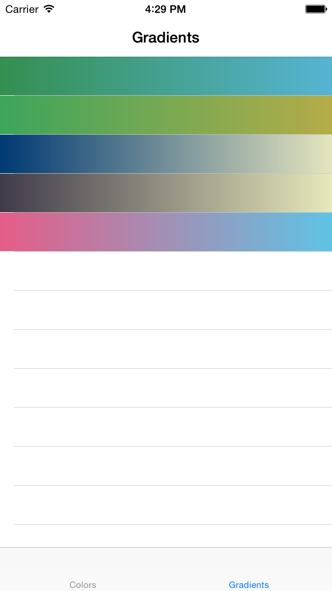

NilColorKit
===========

NilColorKit  predefines Google Material colors and FlatUI colors  as a Swift extension to UIColor.

Usage
=====

Copy NilColorKit.swift to your project and use as the predefined colors in UIColor.

Material color or FlatUI color
    
    cell.backgroundColor = UIColor.materialRed()

Gradients    
    
    let startColor: UIColor =  UIColor.uig_emeraldWaterStartColor()
    
    let endColor: UIColor = UIColor.uig_emeraldWaterEndColor()
    
    let gradient: CAGradientLayer = CAGradientLayer()
    gradient.frame = cell.contentView.bounds
    gradient.startPoint = CGPointMake(0.0, 0.5)
    gradient.endPoint = CGPointMake(1.0, 0.5)
    gradient.colors = [startColor.CGColor!,   endColor.CGColor!]
        
The color palette is here. 

##### Google Material Colors

##### FlatUI Colors

##### Gradients Colors Demo

The API list and color palette are here.

              UIColor.materialRed()        
              UIColor.materialRed50()
              UIColor.materialRed100()
              UIColor.materialRed200()
              UIColor.materialRed300()
              UIColor.materialRed400()
              UIColor.materialRed500()
              UIColor.materialRed600()
              UIColor.materialRed700()
              UIColor.materialRed800()
              UIColor.materialRed900()
              UIColor.materialRedA100()
              UIColor.materialRedA200()
              UIColor.materialRedA400()
              UIColor.materialRedA700()
              
	          UIColor.materialPink()
              UIColor.materialPink50()
              UIColor.materialPink100()
              UIColor.materialPink200()
              UIColor.materialPink300()
              UIColor.materialPink400()
              UIColor.materialPink500()
              UIColor.materialPink600()
              UIColor.materialPink700()
              UIColor.materialPink800()
              UIColor.materialPink900()
              UIColor.materialPinkA100()
              UIColor.materialPinkA200()
              UIColor.materialPinkA400()
              UIColor.materialPinkA700()
        
	          UIColor.materialPurple()
              UIColor.materialPurple50()
              UIColor.materialPurple100()
              UIColor.materialPurple200()
              UIColor.materialPurple300()
              UIColor.materialPurple400()
              UIColor.materialPurple500()
              UIColor.materialPurple600()
              UIColor.materialPurple700()
              UIColor.materialPurple800()
              UIColor.materialPurple900()
              UIColor.materialPurpleA100()
              UIColor.materialPurpleA200()
              UIColor.materialPurpleA400()
              UIColor.materialPurpleA700()
       
              UIColor.materialDeepPurple()
              UIColor.materialDeepPurple50()
              UIColor.materialDeepPurple100()
              UIColor.materialDeepPurple200()
              UIColor.materialDeepPurple300()
              UIColor.materialDeepPurple400()
              UIColor.materialDeepPurple500()
              UIColor.materialDeepPurple600()
              UIColor.materialDeepPurple700()
              UIColor.materialDeepPurple800()
              UIColor.materialDeepPurple900()
              UIColor.materialDeepPurpleA100()
              UIColor.materialDeepPurpleA200()
              UIColor.materialDeepPurpleA400()
              UIColor.materialDeepPurpleA700()
    
              UIColor.materialIndigo()
              UIColor.materialIndigo50()
              UIColor.materialIndigo100()
              UIColor.materialIndigo200()
              UIColor.materialIndigo300()
              UIColor.materialIndigo400()
              UIColor.materialIndigo500()
              UIColor.materialIndigo600()
              UIColor.materialIndigo700()
              UIColor.materialIndigo800()
              UIColor.materialIndigo900()
              UIColor.materialIndigoA100()
              UIColor.materialIndigoA200()
              UIColor.materialIndigoA400()
              UIColor.materialIndigoA700()

    
              UIColor.materialBlue()
              UIColor.materialBlue50()
              UIColor.materialBlue100()
              UIColor.materialBlue200()
              UIColor.materialBlue300()
              UIColor.materialBlue400()
              UIColor.materialBlue500()
              UIColor.materialBlue600()
              UIColor.materialBlue700()
              UIColor.materialBlue800()
              UIColor.materialBlue900()
              UIColor.materialBlueA100()
              UIColor.materialBlueA200()
              UIColor.materialBlueA400()
              UIColor.materialBlueA700()
            
        
              UIColor.materialLightBlue()
              UIColor.materialLightBlue50()
              UIColor.materialLightBlue100()
              UIColor.materialLightBlue200()
              UIColor.materialLightBlue300()
              UIColor.materialLightBlue400()
              UIColor.materialLightBlue500()
              UIColor.materialLightBlue600()
              UIColor.materialLightBlue700()
              UIColor.materialLightBlue800()
              UIColor.materialLightBlue900()
              UIColor.materialLightBlueA100()
              UIColor.materialLightBlueA200()
              UIColor.materialLightBlueA400()
              UIColor.materialLightBlueA700()
            

        
              UIColor.materialCyan()
              UIColor.materialCyan50()
              UIColor.materialCyan100()
              UIColor.materialCyan200()
              UIColor.materialCyan300()
              UIColor.materialCyan400()
              UIColor.materialCyan500()
              UIColor.materialCyan600()
              UIColor.materialCyan700()
              UIColor.materialCyan800()
              UIColor.materialCyan900()
              UIColor.materialCyanA100()
              UIColor.materialCyanA200()
              UIColor.materialCyanA400()
              UIColor.materialCyanA700()
    
        
              UIColor.materialTeal()
              UIColor.materialTeal50()
              UIColor.materialTeal100()
              UIColor.materialTeal200()
              UIColor.materialTeal300()
              UIColor.materialTeal400()
              UIColor.materialTeal500()
              UIColor.materialTeal600()
              UIColor.materialTeal700()
              UIColor.materialTeal800()
              UIColor.materialTeal900()
              UIColor.materialTealA100()
              UIColor.materialTealA200()
              UIColor.materialTealA400()
              UIColor.materialTealA700()
    
              UIColor.materialGreen()
              UIColor.materialGreen50()
              UIColor.materialGreen100()
              UIColor.materialGreen200()
              UIColor.materialGreen300()
              UIColor.materialGreen400()
              UIColor.materialGreen500()
              UIColor.materialGreen600()
              UIColor.materialGreen700()
              UIColor.materialGreen800()
              UIColor.materialGreen900()
              UIColor.materialGreenA100()
              UIColor.materialGreenA200()
              UIColor.materialGreenA400()
              UIColor.materialGreenA700()
    
              UIColor.materialLightGreen()
              UIColor.materialLightGreen50()
              UIColor.materialLightGreen100()
              UIColor.materialLightGreen200()
              UIColor.materialLightGreen300()
              UIColor.materialLightGreen400()
              UIColor.materialLightGreen500()
              UIColor.materialLightGreen600()
              UIColor.materialLightGreen700()
              UIColor.materialLightGreen800()
              UIColor.materialLightGreen900()
              UIColor.materialLightGreenA100()
              UIColor.materialLightGreenA200()
              UIColor.materialLightGreenA400()
              UIColor.materialLightGreenA700()
    
              UIColor.materialLime()
              UIColor.materialLime50()
              UIColor.materialLime100()
              UIColor.materialLime200()
              UIColor.materialLime300()
              UIColor.materialLime400()
              UIColor.materialLime500()
              UIColor.materialLime600()
              UIColor.materialLime700()
              UIColor.materialLime800()
              UIColor.materialLime900()
              UIColor.materialLimeA100()
              UIColor.materialLimeA200()
              UIColor.materialLimeA400()
              UIColor.materialLimeA700()
    
              UIColor.materialCyan()
              UIColor.materialYellow50()
              UIColor.materialYellow100()
              UIColor.materialYellow200()
              UIColor.materialYellow300()
              UIColor.materialYellow400()
              UIColor.materialYellow500()
              UIColor.materialYellow600()
              UIColor.materialYellow700()
              UIColor.materialYellow800()
              UIColor.materialYellow900()
              UIColor.materialYellowA100()
              UIColor.materialYellowA200()
              UIColor.materialYellowA400()
              UIColor.materialYellowA700()
    
              UIColor.materialAmber()
              UIColor.materialAmber50()
              UIColor.materialAmber100()
              UIColor.materialAmber200()
              UIColor.materialAmber300()
              UIColor.materialAmber400()
              UIColor.materialAmber500()
              UIColor.materialAmber600()
              UIColor.materialAmber700()
              UIColor.materialAmber800()
              UIColor.materialAmber900()
              UIColor.materialAmberA100()
              UIColor.materialAmberA200()
              UIColor.materialAmberA400()
              UIColor.materialAmberA700()
    
              UIColor.materialOrange()
              UIColor.materialOrange50()
              UIColor.materialOrange100()
              UIColor.materialOrange200()
              UIColor.materialOrange300()
              UIColor.materialOrange400()
              UIColor.materialOrange500()
              UIColor.materialOrange600()
              UIColor.materialOrange700()
              UIColor.materialOrange800()
              UIColor.materialOrange900()
              UIColor.materialOrangeA100()
              UIColor.materialOrangeA200()
              UIColor.materialOrangeA400()
              UIColor.materialOrangeA700()
    
              UIColor.materialDeepOrange()
              UIColor.materialDeepOrange50()
              UIColor.materialDeepOrange100()
              UIColor.materialDeepOrange200()
              UIColor.materialDeepOrange300()
              UIColor.materialDeepOrange400()
              UIColor.materialDeepOrange500()
              UIColor.materialDeepOrange600()
              UIColor.materialDeepOrange700()
              UIColor.materialDeepOrange800()
              UIColor.materialDeepOrange900()
              UIColor.materialDeepOrangeA100()
              UIColor.materialDeepOrangeA200()
              UIColor.materialDeepOrangeA400()
              UIColor.materialDeepOrangeA700()
        
              UIColor.materialBrown()
              UIColor.materialBrown50()
              UIColor.materialBrown100()
              UIColor.materialBrown200()
              UIColor.materialBrown300()
              UIColor.materialBrown400()
              UIColor.materialBrown500()
              UIColor.materialBrown600()
              UIColor.materialBrown700()
              UIColor.materialBrown800()
              UIColor.materialBrown900()
        
              UIColor.materialGrey()
              UIColor.materialGrey50()
              UIColor.materialGrey100()
              UIColor.materialGrey200()
              UIColor.materialGrey300()
              UIColor.materialGrey400()
              UIColor.materialGrey500()
              UIColor.materialGrey600()
              UIColor.materialGrey700()
              UIColor.materialGrey800()
              UIColor.materialGrey900()
        
              UIColor.materialBlueGrey()
              UIColor.materialBlueGrey50()
              UIColor.materialBlueGrey100()
              UIColor.materialBlueGrey200()
              UIColor.materialBlueGrey300()
              UIColor.materialBlueGrey400()
              UIColor.materialBlueGrey500()
              UIColor.materialBlueGrey600()
              UIColor.materialBlueGrey700()
              UIColor.materialBlueGrey800()
              UIColor.materialBlueGrey900()
        
              UIColor.flatTurquoiseColor()
              UIColor.flatGreenSeaColor()
              UIColor.flatEmerlandColor()
              UIColor.flatNephritisColor()
              UIColor.flatPeterRiverColor()
              UIColor.flatBelizeHoleColor()
              UIColor.flatAmethystColor()
              UIColor.flatWisteriaColor()
              UIColor.flatWetAsphaltColor()
              UIColor.flatMidnightBlueColor()
              UIColor.flatSunflowerColor()
              UIColor.flatTangerineColor()
            

Gradients API 

    	 //MARK:  Emerald Water

	UIColor.uig_emeraldWaterStartColor()
	UIColor.uig_emeraldWaterEndColor()

	//MARK:  Lemon Twist

	UIColor.uig_lemonTwistStartColor()
	UIColor.uig_lemonTwistEndColor()

	//MARK:  Horizon

	UIColor.uig_horizonStartColor()
	UIColor.uig_horizonEndColor()

	//MARK:  Rose Water

	UIColor.uig_roseWaterStartColor()
	UIColor.uig_roseWaterEndColor()

	//MARK:  Frozen

	UIColor.uig_frozenStartColor()
	UIColor.uig_frozenEndColor()

	//MARK:  Mango Pulp

	UIColor.uig_mangoPulpStartColor()
	UIColor.uig_mangoPulpEndColor()

	//MARK:  Bloody Mary

	UIColor.uig_bloodyMaryStartColor()
	UIColor.uig_bloodyMaryEndColor()

	//MARK:  Aubergine

	UIColor.uig_aubergineStartColor()
	UIColor.uig_aubergineEndColor()

	//MARK:  Aqua Marine

	UIColor.uig_aquaMarineStartColor()
	UIColor.uig_aquaMarineEndColor()

	//MARK:  Sunrise

	UIColor.uig_sunriseStartColor()
	UIColor.uig_sunriseEndColor()

	//MARK:  Purple Paradise

	UIColor.uig_purpleParadiseStartColor()
	UIColor.uig_purpleParadiseEndColor()

	//MARK:  Sea Weed

	UIColor.uig_seaWeedStartColor()
	UIColor.uig_seaWeedEndColor()

	//MARK:  Pinky

	UIColor.uig_pinkyStartColor()
	UIColor.uig_pinkyEndColor()

	//MARK:  Cherry

	UIColor.uig_cherryStartColor()
	UIColor.uig_cherryEndColor()

	//MARK:  Mojito

	UIColor.uig_mojitoStartColor()
	UIColor.uig_mojitoEndColor()

	//MARK:  Juicy Orange

	UIColor.uig_juicyOrangeStartColor()
	UIColor.uig_juicyOrangeEndColor()

	//MARK:  Mirage

	UIColor.uig_mirageStartColor()
	UIColor.uig_mirageEndColor()

	//MARK:  Steel Gray

	UIColor.uig_steelGrayStartColor()
	UIColor.uig_steelGrayEndColor()

	//MARK:  Kashmir

	UIColor.uig_kashmirStartColor()
	UIColor.uig_kashmirEndColor()

	//MARK:  Electric Violet

	UIColor.uig_electricVioletStartColor()
	UIColor.uig_electricVioletEndColor()

	//MARK:  Venice Blue

	UIColor.uig_veniceBlueStartColor()
	UIColor.uig_veniceBlueEndColor()

	//MARK:  Bora Bora

	UIColor.uig_boraBoraStartColor()
	UIColor.uig_boraBoraEndColor()

	//MARK:  Moss

	UIColor.uig_mossStartColor()
	UIColor.uig_mossEndColor()

	//MARK:  Shroom Haze

	UIColor.uig_shroomHazeStartColor()
	UIColor.uig_shroomHazeEndColor()

	//MARK:  Mystic

	UIColor.uig_mysticStartColor()
	UIColor.uig_mysticEndColor()

	//MARK:  Midnight City

	UIColor.uig_midnightCityStartColor()
	UIColor.uig_midnightCityEndColor()

	//MARK:  Sea Blizz

	UIColor.uig_seaBlizzStartColor()
	UIColor.uig_seaBlizzEndColor()

	//MARK:  Opa

	UIColor.uig_opaStartColor()
	UIColor.uig_opaEndColor()

	//MARK:  Titanium

	UIColor.uig_titaniumStartColor()
	UIColor.uig_titaniumEndColor()

	//MARK:  Mantle

	UIColor.uig_mantleStartColor()
	UIColor.uig_mantleEndColor()

	//MARK:  Dracula

	UIColor.uig_draculaStartColor()
	UIColor.uig_draculaEndColor()

	//MARK:  Peach

	UIColor.uig_peachStartColor()
	UIColor.uig_peachEndColor()

	//MARK:  Moonrise

	UIColor.uig_moonriseStartColor()
	UIColor.uig_moonriseEndColor()

	//MARK:  Clouds

	UIColor.uig_cloudsStartColor()
	UIColor.uig_cloudsEndColor()

	//MARK:  Stellar

	UIColor.uig_stellarStartColor()
	UIColor.uig_stellarEndColor()

	//MARK:  Bourbon

	UIColor.uig_bourbonStartColor()
	UIColor.uig_bourbonEndColor()

	//MARK:  Calm Darya

	UIColor.uig_calmDaryaStartColor()
	UIColor.uig_calmDaryaEndColor()

	//MARK:  Influenza

	UIColor.uig_influenzaStartColor()
	UIColor.uig_influenzaEndColor()

	//MARK:  Shrimpy

	UIColor.uig_shrimpyStartColor()
	UIColor.uig_shrimpyEndColor()

	//MARK:  Army

	UIColor.uig_armyStartColor()
	UIColor.uig_armyEndColor()

	//MARK:  Miaka

	UIColor.uig_miakaStartColor()
	UIColor.uig_miakaEndColor()

	//MARK:  Pinot Noir

	UIColor.uig_pinotNoirStartColor()
	UIColor.uig_pinotNoirEndColor()

	//MARK:  Day Tripper

	UIColor.uig_dayTripperStartColor()
	UIColor.uig_dayTripperEndColor()

	//MARK:  Namn

	UIColor.uig_namnStartColor()
	UIColor.uig_namnEndColor()

	//MARK:  Blurry Beach

	UIColor.uig_blurryBeachStartColor()
	UIColor.uig_blurryBeachEndColor()

	//MARK:  Vasily

	UIColor.uig_vasilyStartColor()
	UIColor.uig_vasilyEndColor()

	//MARK:  A Lost Memory

	UIColor.uig_aLostMemoryStartColor()
	UIColor.uig_aLostMemoryEndColor()

	//MARK:  Petrichor

	UIColor.uig_petrichorStartColor()
	UIColor.uig_petrichorEndColor()

	//MARK:  Jonquil

	UIColor.uig_jonquilStartColor()
	UIColor.uig_jonquilEndColor()

	//MARK:  Sirius Tamed

	UIColor.uig_siriusTamedStartColor()
	UIColor.uig_siriusTamedEndColor()

	//MARK:  Kyoto

	UIColor.uig_kyotoStartColor()
	UIColor.uig_kyotoEndColor()

	//MARK:  Misty Meadow

	UIColor.uig_mistyMeadowStartColor()
	UIColor.uig_mistyMeadowEndColor()

	//MARK:  Aqualicious

	UIColor.uig_aqualiciousStartColor()
	UIColor.uig_aqualiciousEndColor()

	//MARK:  Moor

	UIColor.uig_moorStartColor()
	UIColor.uig_moorEndColor()

	//MARK:  Almost

	UIColor.uig_almostStartColor()
	UIColor.uig_almostEndColor()

	//MARK:  Forever Lost

	UIColor.uig_foreverLostStartColor()
	UIColor.uig_foreverLostEndColor()

	//MARK:  Winter

	UIColor.uig_winterStartColor()
	UIColor.uig_winterEndColor()

	//MARK:  Autumn

	UIColor.uig_autumnStartColor()
	UIColor.uig_autumnEndColor()

	//MARK:  Candy

	UIColor.uig_candyStartColor()
	UIColor.uig_candyEndColor()

	//MARK:  Reef

	UIColor.uig_reefStartColor()
	UIColor.uig_reefEndColor()

	//MARK:  The Strain

	UIColor.uig_theStrainStartColor()
	UIColor.uig_theStrainEndColor()

	//MARK:  Dirty Fog

	UIColor.uig_dirtyFogStartColor()
	UIColor.uig_dirtyFogEndColor()

	//MARK:  Earthly

	UIColor.uig_earthlyStartColor()
	UIColor.uig_earthlyEndColor()

	//MARK:  Virgin

	UIColor.uig_virginStartColor()
	UIColor.uig_virginEndColor()

	//MARK:  Ash

	UIColor.uig_ashStartColor()
	UIColor.uig_ashEndColor()

	//MARK:  Shadow Night

	UIColor.uig_shadowNightStartColor()
	UIColor.uig_shadowNightEndColor()

	//MARK:  Cherryblossoms

	UIColor.uig_cherryblossomsStartColor()
	UIColor.uig_cherryblossomsEndColor()

	//MARK:  Parklife

	UIColor.uig_parklifeStartColor()
	UIColor.uig_parklifeEndColor()

	//MARK:  Dance To Forget

	UIColor.uig_danceToForgetStartColor()
	UIColor.uig_danceToForgetEndColor()

	//MARK:  Starfall

	UIColor.uig_starfallStartColor()
	UIColor.uig_starfallEndColor()

	//MARK:  Red Mist

	UIColor.uig_redMistStartColor()
	UIColor.uig_redMistEndColor()

	//MARK:  Teal Love

	UIColor.uig_tealLoveStartColor()
	UIColor.uig_tealLoveEndColor()

	//MARK:  Neon Life

	UIColor.uig_neonLifeStartColor()
	UIColor.uig_neonLifeEndColor()

	//MARK:  Man of Steel

	UIColor.uig_manofSteelStartColor()
	UIColor.uig_manofSteelEndColor()

	//MARK:  Amethyst

	UIColor.uig_amethystStartColor()
	UIColor.uig_amethystEndColor()

	//MARK:  Cheer Up Emo Kid

	UIColor.uig_cheerUpEmoKidStartColor()
	UIColor.uig_cheerUpEmoKidEndColor()

	//MARK:  Shore

	UIColor.uig_shoreStartColor()
	UIColor.uig_shoreEndColor()

	//MARK:  Facebook Messenger

	UIColor.uig_facebookMessengerStartColor()
	UIColor.uig_facebookMessengerEndColor()

	//MARK:  SoundCloud

	UIColor.uig_soundCloudStartColor()
	UIColor.uig_soundCloudEndColor()

	//MARK:  Behongo

	UIColor.uig_behongoStartColor()
	UIColor.uig_behongoEndColor()
    
###### *Note:*
NilThemeKit in sample code is another open sourced framework to help developer create color themes.
You can get it from [here](https://github.com/NilStack/NilThemeKit).

License
=====

Under MIT License. Please refer to LICENSE.md.